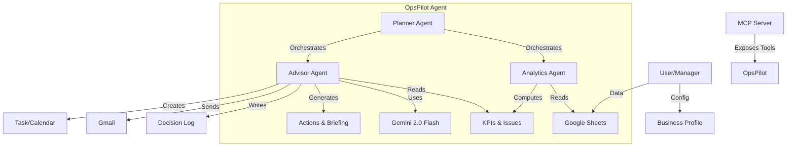

# OpsPilot: The AI Operations Manager for Small Business

**Track**: Enterprise Agents

## 1. The Problem: Drowning in Data, Starving for Insights
Small business owners—whether running a bustling cafe, a boutique gym, or a local clinic—are overwhelmed. They are experts in their craft but often struggle with the "business" side of operations.

Data is everywhere but nowhere useful. Sales are in a POS system, inventory in a spreadsheet, staff schedules on a whiteboard, and supplier emails in an overflowing inbox. To get a clear picture of their business, an owner must manually aggregate this data, often spending hours late at night crunching numbers.

The result?
*   **Reactive Management**: Issues like low inventory or staffing gaps are found only *after* they cause problems.
*   **Analysis Paralysis**: With too much raw data and no clear insights, decisions are delayed.
*   **Burnout**: The mental load of constantly "checking the numbers" prevents owners from focusing on growth and customer experience.

They don't need another dashboard. They need a manager.

## 2. The Solution: OpsPilot
**OpsPilot** is a Multi-Business AI Operations Co-Pilot that acts as an intelligent, proactive manager. It doesn't just display data; it **thinks** about it and **acts** on it.

Built on a robust multi-agent architecture and the **Model Context Protocol (MCP)**, OpsPilot connects directly to the tools SMEs already use—primarily **Google Sheets**—to automate the daily operations review.

### How It Works (The "Cafe Delight" Story)
Imagine "Cafe Delight," a local coffee shop. Every morning at 8:00 AM, OpsPilot wakes up and goes to work:

1.  **The Planner Agent** initiates the daily review workflow.
2.  **The Analytics Agent** pulls the latest sales, inventory, and staffing data from the cafe's Google Sheet. It computes KPIs (Revenue, Orders, Wastage) and checks them against custom thresholds defined in the cafe's "Business Profile."
    *   *Detection*: It notices that "Coffee Beans" are down to 5kg, below the 10kg safety threshold.
3.  **The Advisor Agent** (powered by **Google Gemini 2.0 Flash**) analyzes this finding. It understands that low coffee beans on a Friday is critical.
4.  **The Action**:
    *   It **logs** the issue in the "Decision Log" for auditability.
    *   It **creates a task** in the manager's task tracker: "Order Coffee Beans (Urgent)."
    *   It **drafts a briefing email** to the owner: *"Good morning! Revenue is up 10%, but we are critically low on coffee beans. I've added a task to restock immediately."*

This entire process happens automatically, before the owner has even had their first cup of coffee.

## 3. Technical Architecture
OpsPilot demonstrates the power of modern Agentic AI through three key pillars:

### A. Multi-Agent Orchestration
We moved beyond a single LLM loop to a specialized team of agents:
*   **Planner**: The conductor that manages state and workflow execution.
*   **Analytics Agent**: A deterministic, code-based agent using Pandas. It ensures 100% accuracy for math and data validation—areas where LLMs can hallucinate.
*   **Advisor Agent**: The creative/reasoning layer. It uses **Gemini 2.0 Flash** to interpret the hard data, generate human-readable insights, and decide on the appropriate tone for communication.

### B. Model Context Protocol (MCP)
OpsPilot is built to be interoperable. By exposing its tools ( `load_table`, `detect_issues`, `save_decision_log`) via an **MCP Server**, OpsPilot becomes a "skill" that can be used by other AI assistants.
*   *Example*: A user can open **Claude Desktop**, connect to the OpsPilot MCP server, and ask, *"What was the highest revenue day last week?"* The desktop agent can then use OpsPilot's tools to answer, creating a seamless ecosystem.

### C. Real-World Integration
We prioritized "Real Acting" over simulation. OpsPilot integrates with:
*   **Google Sheets API**: For reading/writing business data.
*   **Gmail API**: For sending real notifications.
*   **Google Calendar API**: For scheduling review meetings.

### Architecture Diagram

## 4. Business Value & Impact
OpsPilot delivers tangible ROI for small businesses:

*   **Reclaim 5+ Hours/Week**: By automating the manual data aggregation and review process, managers save an hour every day.
*   **Prevent Revenue Leakage**: Proactive alerts on inventory stockouts mean the cafe never has to turn away a customer because they ran out of milk.
*   **Operational Resilience**: The system never sleeps, never forgets to check the numbers, and provides a consistent audit trail of all operational decisions.
*   **Zero-Friction Adoption**: Because it connects to Google Sheets, owners don't need to learn a new complex software. They just keep using the spreadsheets they know.

## 5. Scalability & Future
OpsPilot is designed to be **industry-agnostic**. The "Business Profile" configuration allows it to adapt instantly:
*   **Gyms**: Track active memberships and equipment maintenance.
*   **Clinics**: Monitor patient wait times and supply inventory.
*   **Retail**: Track daily footfall and shelf availability.

OpsPilot is not just a tool; it's the future of autonomous small business operations. It empowers owners to stop working *in* their business and start working *on* their business.
